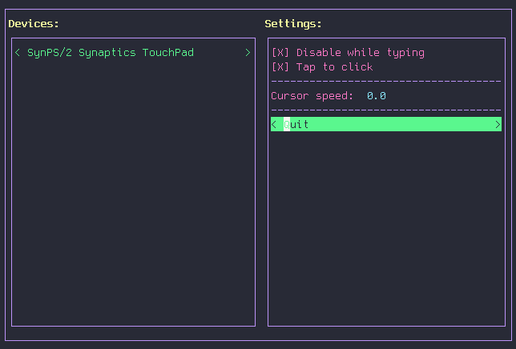

# Touchpy

A Text User Interface to configure mouse and touchpad devices in Linux with `libinput`.



Touchpy provides an easy way to configure the following settings using `libinput`:

  * Cursor speed.
  * Tap to click.
  * Disable touchpad while typing.

You can also configure Touchpy's color scheme by editing its configuracion file located at  `~/.config/touchpy/config.ini`.

**Note**: Touchpy can only configure devices managed through libinput, i.e., it cannot configure devices that use the Synaptics drivers.

## Getting Started

### Dependencies

  * `libinput`
  * `Python 3.7+`
  * `urwid 2.1+`

### Installing

  **Note**: It is recommended to create a virtual environment to install dependencies.

  1. Clone the repository to a local directory:
```sh
$ git clone https://github.com/mariomartinezm/touchpy
```

  2. Install dependencies with `pip install touchpy`

  3. `cd` into the repository.

  4. Run with `python touchpy`.

## Contributing

Please read [CONTRIBUTING.md](https://gist.github.com/PurpleBooth/b24679402957c63ec426) for details on our code of conduct, and the process for submitting pull requests to us.

## Version

Version 0.1 

## Author

* **Mario Martínez-Molina** [mariomartinezm](https://github.com/mariomartinezm)

## License

This project is licensed under the LGPL v2.1 License - see the [LICENSE.md](LICENSE.md) file for details

## Acknowledgments

* To [TsukiZombina](https://github.com/TsukiZombina)
